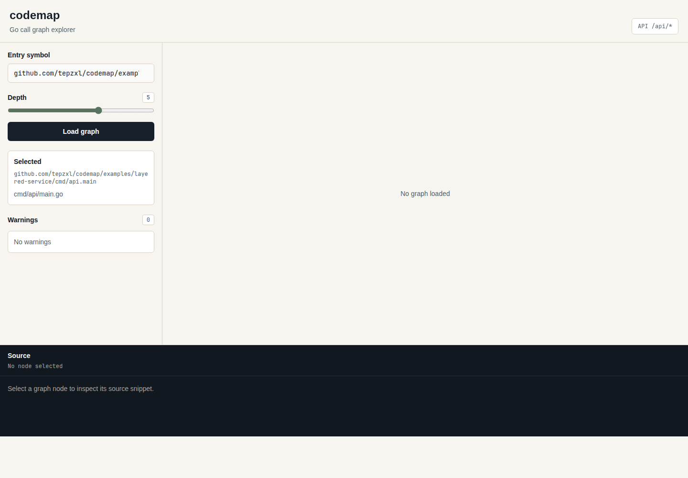

# codemap

`codemap` is a local-first Go static analysis and call graph explorer. It scans a local Go module or workspace, extracts statically resolvable function and method calls, and serves an interactive React Flow UI for inspecting call chains, source snippets, and callsites.

## v0.2 Features

- Local Go module scanning with `go/packages`.
- Function and method symbol extraction with stable IDs.
- Resolved, interface, external, and unresolved call extraction.
- Depth-limited graph traversal from an entry symbol.
- Interface implementation candidate expansion behind `--expand-interface` / `expand_interface=true`.
- CLI, HTTP API, and local web UI using the same graph filtering options.
- Web symbol search, package filter, depth control, and graph filter toggles.
- Node source viewing through `/api/source`.
- Edge callsite viewing through `/api/callsite`.
- Project metadata through `/api/meta`.
- Manual cached-index refresh through `/api/rescan`.
- Static web assets embedded into the Go server binary.

Default behavior stays conservative: standard library and third-party calls are hidden, unresolved calls are hidden, and interface implementation candidates are not expanded unless explicitly requested.

## Tech Stack

- Go, `go/packages`, `go/ast`, `go/types`, `net/http`, `embed`
- Next.js, React, TypeScript, Tailwind CSS, React Flow
- pnpm through Corepack for frontend dependency management

## Install

Prerequisites:

- Go 1.25 or newer
- Node.js with Corepack

Install frontend dependencies:

```bash
make install
```

## Build And Test

Run the full quality gate:

```bash
make check
```

`make check` runs Go tests, CLI smoke checks, v0.1 golden output verification, frontend lint, TypeScript checks, and the Next production build.

Build the static web UI and stage it for Go embed:

```bash
make web-build
```

Build the local Go binary:

```bash
make build
```

The binary is written to:

```text
bin/codemap
```

`go build` does not run pnpm. Run `make web-build` before `make build` when the binary should include the current frontend.

Build release binaries:

```bash
make release
```

Release artifacts are written to:

```text
dist/codemap-linux-amd64
dist/codemap-darwin-arm64
dist/codemap-darwin-amd64
```

## Quick Demo

Run the layered-service demo:

```bash
make web-build
make build
./bin/codemap serve ./examples/layered-service --port 8080
```

Open:

```text
http://localhost:8080
```

In the UI:

1. Search or select `main.main`.
2. Click `Load graph`.
3. Inspect the `main -> handler -> service -> repository` call chain.
4. Click `UserService.CreateUser` to view node source.
5. Click an edge to view the callsite line.
6. Toggle filters or depth to refresh the graph.
7. Click `Rescan` after changing local source files.

More details: [docs/demo/README.md](docs/demo/README.md).



## CLI Examples

Scan packages:

```bash
go run ./cmd/codemap scan ./examples/simple
```

List symbols:

```bash
go run ./cmd/codemap symbols ./examples/layered-service
```

List calls:

```bash
go run ./cmd/codemap calls ./examples/layered-service
```

Build a graph:

```bash
go run ./cmd/codemap graph ./examples/layered-service --entry main.main --depth 5
```

Show external calls:

```bash
go run ./cmd/codemap graph ./examples/layered-service --entry main.main --depth 5 --show-external
```

Show unresolved calls:

```bash
go run ./cmd/codemap graph ./examples/layered-service --entry main.main --depth 5 --show-unresolved
```

Show interface calls without candidate expansion:

```bash
go run ./cmd/codemap graph ./examples/interface-call --entry main.main --depth 5 --show-interface
```

Expand interface implementation candidates:

```bash
go run ./cmd/codemap graph ./examples/interface-call --entry main.main --depth 5 --expand-interface
```

Filter by package or node limit:

```bash
go run ./cmd/codemap graph ./examples/layered-service --entry main.main --depth 5 --package github.com/tepzxl/codemap/examples/layered-service/internal/service
go run ./cmd/codemap graph ./examples/layered-service --entry main.main --depth 5 --node-limit 100
```

Serve API and UI:

```bash
go run ./cmd/codemap serve ./examples/layered-service --port 8080
```

## HTTP API

Health:

```bash
curl -s http://localhost:8080/api/health
```

Metadata:

```bash
curl -s http://localhost:8080/api/meta | python -m json.tool
```

Manual rescan:

```bash
curl -s -X POST http://localhost:8080/api/rescan | python -m json.tool
```

Symbols:

```bash
curl -s http://localhost:8080/api/symbols
```

Graph:

```bash
curl -s "http://localhost:8080/api/graph?entry=main.main&depth=5"
```

Graph with filters:

```bash
curl -s "http://localhost:8080/api/graph?entry=main.main&depth=5&show_external=true"
curl -s "http://localhost:8080/api/graph?entry=main.main&depth=5&show_unresolved=true"
curl -s "http://localhost:8080/api/graph?entry=main.main&depth=5&show_interface=true"
curl -s "http://localhost:8080/api/graph?entry=main.main&depth=5&expand_interface=true"
curl -s "http://localhost:8080/api/graph?entry=main.main&depth=5&package=github.com/tepzxl/codemap/examples/layered-service/internal/service"
curl -s "http://localhost:8080/api/graph?entry=main.main&depth=5&node_limit=100"
```

Node source:

```bash
curl -s "http://localhost:8080/api/source?node_id=<symbol-id>"
```

Edge callsite:

```bash
curl -s "http://localhost:8080/api/callsite?edge_id=<edge-id>&entry=main.main&depth=5"
```

Warnings:

```bash
curl -s http://localhost:8080/api/warnings
```

## CI

GitHub Actions runs:

```bash
make check
make web-build
make build
```

The workflow enables Corepack and activates the pnpm version declared by `web/package.json`.

## Development

Run Go tests:

```bash
make test-go
```

Run frontend checks:

```bash
make test-web
```

Run individual frontend gates:

```bash
make web-lint
make web-typecheck
make build-web
```

Run the Go API and Next dev server separately:

```bash
make dev-api
make dev-web
```

Or run both together:

```bash
make dev
```

Default dev URLs:

```text
Go API: http://localhost:18080
Web UI: http://127.0.0.1:3000
```

Override ports when needed:

```bash
make dev-web WEB_PORT=3001
make dev-api API_PORT=8080
```

## Architecture

```text
Local Go repo
  -> go/packages loader
  -> AST + type info
  -> symbols
  -> calls
  -> graph builder
  -> CLI / HTTP API
  -> Next + React Flow UI
  -> source and callsite APIs
```

The frontend never scans local files and does not use Next API routes for core analysis. The Go server owns package loading, analysis, graph building, source reading, cached index metadata, and API responses.

## Current Limits

- Only local Go projects are supported.
- Remote GitHub URL scanning is not supported.
- `_test.go` files are ignored by default.
- Interface candidate expansion is static and conservative.
- Dynamic calls through function variables may be marked `unresolved`.
- The graph is a static approximation, not a runtime-precise call trace.
- Standard library and third-party calls are hidden from the default graph unless explicitly shown.
- No database, editor plugin, or LLM explanation layer is included.
