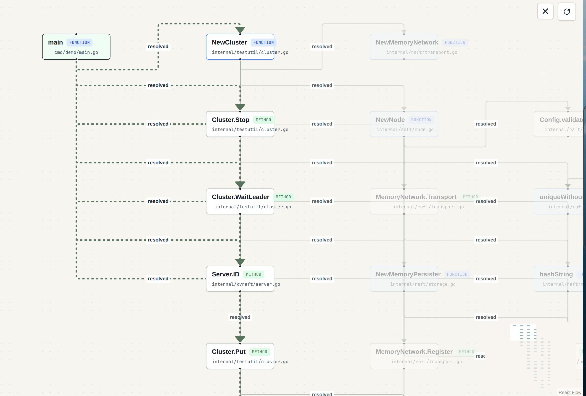
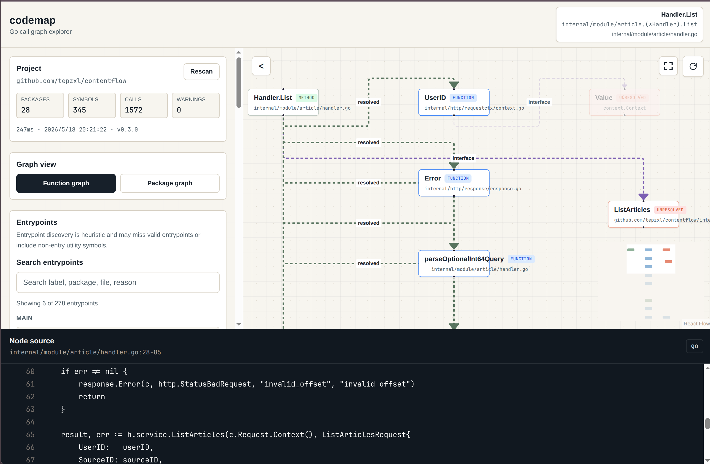

# codemap

`codemap` 是一个本地优先的 Go 代码调用关系可视化工具。它会扫描你机器上的 Go module / workspace，提取函数、方法和静态可解析的调用关系，然后用 Web UI 展示调用图。点击图上的节点或边，可以直接查看对应源码片段或调用点。

它适合用来回答这些问题：

- 一个 Go 项目的入口函数会一路调用到哪些业务模块？
- 某个 handler / service / repository 方法被谁调用，又继续调用了谁？
- 一个大项目里有哪些 package 之间存在业务调用关系？
- 看不懂一段代码时，能不能先用图把主干调用链找出来？

`codemap` 不会上传你的代码，不依赖数据库，也不使用 LLM。分析和展示都在本地完成。

## 效果预览

分布式 KV 项目的调用图：



Web 项目 `contentflow` (个人Web项目Feed推荐流)的调用图和源码面板：



## 快速开始

前置要求：

- Go 1.25.0 或更新版本，以 `go.mod` 为准
- Node.js 24 或兼容版本，并启用 Corepack
- pnpm 由 Corepack 管理，CI 使用 `pnpm@10.20.0`

从仓库根目录运行：

```bash
make install
make web-build
make build
./bin/codemap serve ./examples/layered-service --port 8080
```

打开浏览器：

```text
http://localhost:8080
```

在页面中：

1. 在 `Entrypoints` 中选择 `main`，或在 `Entry symbol` 搜索 `main.main`。
2. 点击 `Load graph`。
3. 查看 `main -> handler -> service -> repository` 调用链。
4. 点击节点查看函数源码。
5. 点击边查看调用点源码。
6. 调整 `Depth` 控制调用深度。
7. 点击图右上角全屏按钮，只看调用图。

## 分析自己的 Go 项目

构建一次 binary 后，可以直接把任意本地 Go 项目路径传给 `serve`：

```bash
./bin/codemap serve /path/to/your/go/project --port 8080
```

例如：

```bash
./bin/codemap serve /home/tep/dev/tutorial/distributedkv --port 8080
./bin/codemap serve /home/tep/dev/real_project/contentflow --port 8080
```

如果你正在开发 `codemap`，也可以不构建 binary，直接运行：

```bash
go run ./cmd/codemap serve ./examples/layered-service --port 8080
```

默认行为比较保守：

- 默认忽略 `_test.go`。
- 默认隐藏标准库和第三方依赖调用。
- 默认隐藏 unresolved 调用。
- 接口调用默认只标记为 `interface`，只有启用 `Expand interface candidates` 才展示候选实现。

## Web UI 怎么用

左侧是控制区，右侧是调用图，底部是源码面板。

常用操作：

- `Entrypoints`：自动发现候选入口，优先展示 `main` 函数，也会提示 handler、service、goroutine starter 等候选。
- `Entry symbol`：手动搜索函数或方法，支持按 label、id、package、file、receiver 搜索。
- `Depth`：控制从入口向下展开几层调用。
- `Graph filters`：按需显示 external、unresolved、interface 调用，或展开接口候选实现。
- `Current graph`：查看当前图的节点数、边数、package 数和 resolution 分布。
- `Focus downstream`：从选中节点向下看它调用了谁。
- `Focus upstream`：从选中节点向上看谁调用了它。
- `Focus neighborhood`：同时看选中节点的上下游邻域。
- `Search current graph`：在当前图里快速定位节点。
- `Package graph`：把函数调用图聚合成 package-level overview。
- `Path search`：查询两个 symbols 之间的静态调用路径。
- `Rescan`：本地源码修改后，重新扫描项目。
- 图区域右上角全屏按钮：隐藏侧栏和源码面板，只显示当前 graph。

## CLI 常用命令

扫描 package：

```bash
go run ./cmd/codemap scan ./examples/simple
```

列出函数和方法：

```bash
go run ./cmd/codemap symbols ./examples/layered-service
```

列出调用边：

```bash
go run ./cmd/codemap calls ./examples/layered-service
```

发现入口候选：

```bash
go run ./cmd/codemap entrypoints ./examples/layered-service
```

从入口构建调用图：

```bash
go run ./cmd/codemap graph ./examples/layered-service --entry main.main --depth 5
```

查看上游调用：

```bash
go run ./cmd/codemap graph ./examples/layered-service \
  --entry 'github.com/tepzxl/codemap/examples/layered-service/internal/service.(*UserService).CreateUser' \
  --depth 2 \
  --direction upstream
```

查询两个 symbols 之间的静态调用路径：

```bash
go run ./cmd/codemap path ./examples/layered-service \
  --from main.main \
  --to UserRepository.Save \
  --max-depth 8 \
  --limit 5
```

查看 package 级调用概览：

```bash
go run ./cmd/codemap packages ./examples/layered-service
go run ./cmd/codemap packages ./examples/layered-service --entry main.main --depth 5
```

展示 interface 调用或候选实现：

```bash
go run ./cmd/codemap graph ./examples/interface-call --entry main.main --depth 5 --show-interface
go run ./cmd/codemap graph ./examples/interface-call --entry main.main --depth 5 --expand-interface
```

导出 JSON、Mermaid 或 DOT：

```bash
go run ./cmd/codemap export ./examples/layered-service --entry main.main --depth 5 --format json
go run ./cmd/codemap export ./examples/layered-service --entry main.main --depth 5 --format mermaid
go run ./cmd/codemap export ./examples/layered-service --entry main.main --depth 5 --format dot
```

## HTTP API

启动服务：

```bash
go run ./cmd/codemap serve ./examples/layered-service --port 8080
```

常用接口：

```bash
curl -s http://localhost:8080/api/health
curl -s http://localhost:8080/api/meta | python -m json.tool
curl -s http://localhost:8080/api/symbols | python -m json.tool
curl -s http://localhost:8080/api/entrypoints | python -m json.tool
curl -s "http://localhost:8080/api/graph?entry=main.main&depth=5" | python -m json.tool
curl -s "http://localhost:8080/api/path?from=main.main&to=UserRepository.Save&max_depth=8&limit=5" | python -m json.tool
curl -s "http://localhost:8080/api/package-graph?entry=main.main&depth=5" | python -m json.tool
curl -s "http://localhost:8080/api/source?node_id=<symbol-id>" | python -m json.tool
curl -s "http://localhost:8080/api/callsite?edge_id=<edge-id>&entry=main.main&depth=5" | python -m json.tool
curl -s -X POST http://localhost:8080/api/rescan | python -m json.tool
```

导出接口：

```bash
curl -s "http://localhost:8080/api/export?entry=main.main&depth=5&format=json"
curl -s "http://localhost:8080/api/export?entry=main.main&depth=5&format=mermaid"
curl -s "http://localhost:8080/api/export?entry=main.main&depth=5&format=dot"
```

## 项目结构

```text
cmd/codemap/          CLI 入口
internal/analyzer/    go/packages、AST、types 分析
internal/graph/       调用图、路径查询、package graph、导出
internal/source/      源码片段读取
internal/server/      HTTP API 和静态 Web 资源
web/                  Next.js + React Flow 前端
examples/             可用于 smoke test 的 Go fixture 项目
docs/                 demo、release、golden output 和阶段文档
```

数据流：

```text
Local Go repo
  -> go/packages loader
  -> AST + type info
  -> symbols
  -> calls
  -> graph builder
  -> CLI / HTTP API
  -> Next + React Flow UI
  -> source and callsite APIs
```

前端只负责展示，不扫描本地文件，也不使用 Next API Routes 承担核心分析职责。Go server 负责 package loading、analysis、graph building、source reading、cached index metadata 和 API responses。

## 开发命令

安装前端依赖：

```bash
make install
```

完整质量门禁：

```bash
make check
```

`make check` 会运行 Go 测试、CLI smoke test、golden output 校验、前端 lint、TypeScript 检查和 Next 生产构建。

单独运行：

```bash
make test-go
make smoke
make verify-golden
make web-lint
make web-typecheck
make build-web      # 只构建 web/out/
make web-build      # 构建 web/out/ 并同步到 internal/server/static/
make build          # 构建 bin/codemap
```

本地前后端分离开发：

```bash
make dev-api
make dev-web
```

默认地址：

```text
Go API: http://localhost:18080
Web UI: http://127.0.0.1:3000
```

## 当前限制

- 只支持本地 Go 项目，不支持远程 GitHub URL 扫描。
- 默认忽略 `_test.go` 文件。
- 调用图是静态近似结果，不是运行时精确 trace。
- interface candidate expansion 是静态保守候选，不等同于运行时真实分派。
- 通过函数变量、reflection 或复杂动态分派触发的调用可能会标记为 `unresolved`。
- Path search 查询的是静态调用图路径，不代表运行时必经路径。
- Package graph 是从函数/方法 call graph 聚合得到，不是 import graph。
- Entrypoint discovery 是启发式推荐，不保证完整或绝对准确。
- 标准库和第三方调用默认隐藏，除非显式启用。
- 不包含数据库、编辑器插件或 LLM 解释层。

## 版本说明

当前版本主题是 `v0.3 Focused Graph Exploration`。

- Graph JSON Schema 的必填字段保持稳定。
- `/api/graph` 默认仍按 downstream 方向、depth 5 和保守过滤返回函数级调用图。
- `/api/path`、`/api/package-graph`、`/api/entrypoints` 和 `/api/export` 是 additive API。
- 发布前运行 `make web-build`，确保 `internal/server/static/` 与当前 Web UI 一致。

更多 demo 和 baseline 记录见 [docs/demo/README.md](docs/demo/README.md) 与 [docs/demo/real-projects.md](docs/demo/real-projects.md)。
