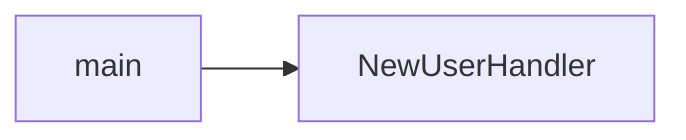
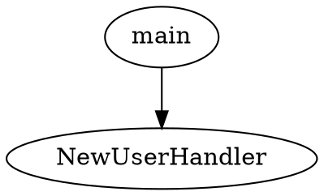

# Stage 25 — Export and Share

## 目标

让当前 graph 视图可以导出和分享，用于 README、文档、排查和面试展示。

## 功能范围

支持导出：

- 当前 graph JSON。
- Mermaid flowchart。
- Graphviz DOT。
- 当前 view URL。

可选支持：

- SVG/PNG 截图。若实现复杂，可暂缓，不作为 v0.3 必须项。

## 允许修改范围

可以修改：

- `internal/graph/*`
- `internal/server/*`
- `internal/cli/*`
- `web/*`
- docs
- tests

不要修改：

- analyzer extraction 核心逻辑
- Graph JSON Schema 必填字段

## 推荐 CLI

```bash
codemap export ./repo --entry main.main --depth 5 --format json
codemap export ./repo --entry main.main --depth 5 --format mermaid
codemap export ./repo --entry main.main --depth 5 --format dot
codemap export ./repo --entry main.main --depth 5 --format mermaid --out graph.mmd
```

## 推荐 API

```text
GET /api/export?entry=main.main&depth=5&format=json
GET /api/export?entry=main.main&depth=5&format=mermaid
GET /api/export?entry=main.main&depth=5&format=dot
```

返回：

- JSON format 返回 `application/json`。
- Mermaid/DOT 返回 `text/plain`。

错误返回 JSON。

## Mermaid 输出要求

输出简单 flowchart：



需要处理特殊字符，避免生成非法 Mermaid。

## DOT 输出要求

输出有效 DOT：



## UI 行为

新增 Export 菜单：

- Copy JSON。
- Download JSON。
- Copy Mermaid。
- Download Mermaid。
- Copy DOT。
- Download DOT。
- Copy view URL。

导出必须基于当前 view state：entry、depth、filters、direction、package 等。

## 测试要求

至少覆盖：

- CLI export json。
- CLI export mermaid。
- CLI export dot。
- API export formats。
- invalid format 返回 JSON error。
- Mermaid/DOT 中特殊字符转义。

## 验收命令

```bash
make check
make web-build
make build
```

手动验收：

```bash
./bin/codemap export ./examples/layered-service --entry main.main --depth 5 --format mermaid
./bin/codemap export ./examples/layered-service --entry main.main --depth 5 --format dot
```

Web UI 中复制 Mermaid，粘贴到 Mermaid viewer 应能显示基本图。

## 成功标准

- 当前图可以导出为 JSON/Mermaid/DOT。
- 导出内容和当前 filters 一致。
- Copy view URL 可用。
- 错误处理清晰。

## 常见失败模式

- 导出忽略 filters。
- Mermaid/DOT 未转义特殊字符。
- CLI 和 API 输出不一致。
- Web 下载文件名不清晰。
